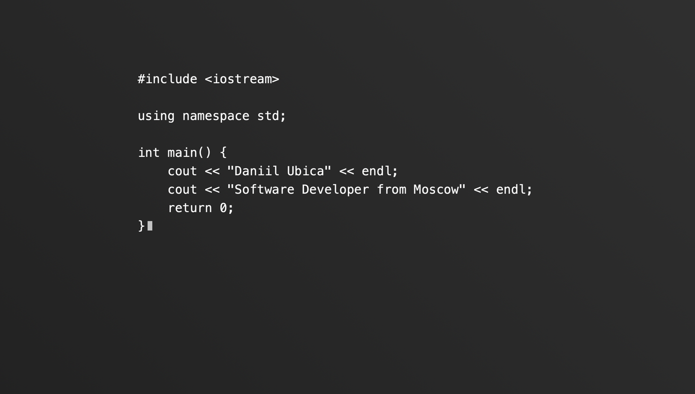
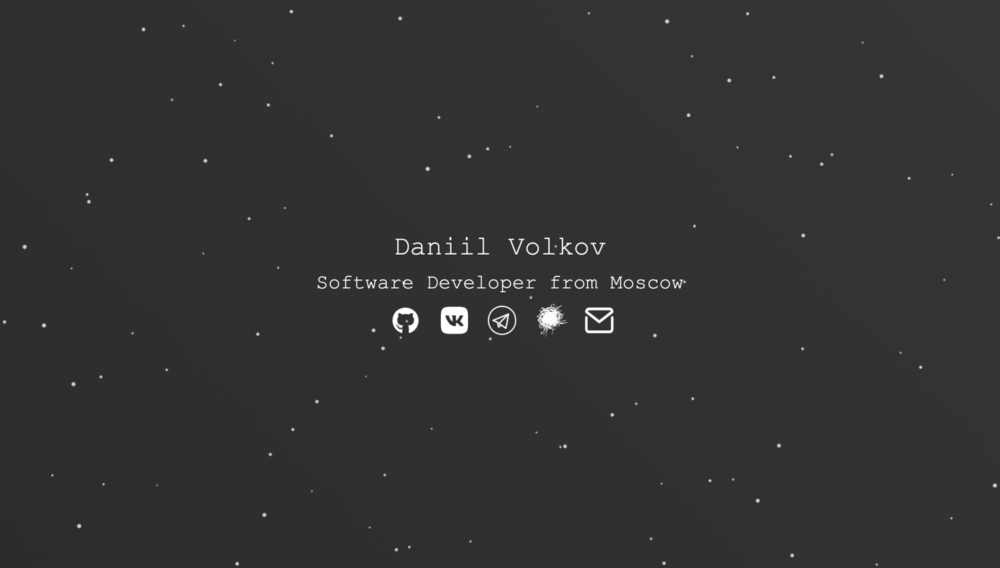
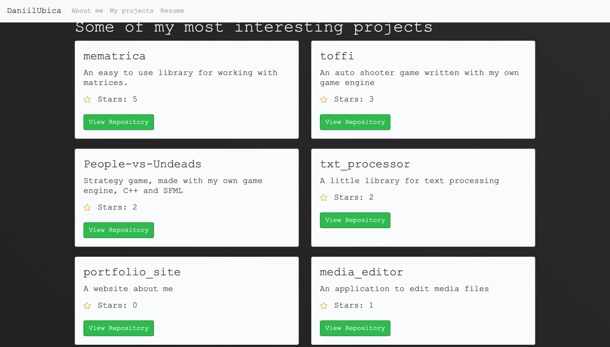
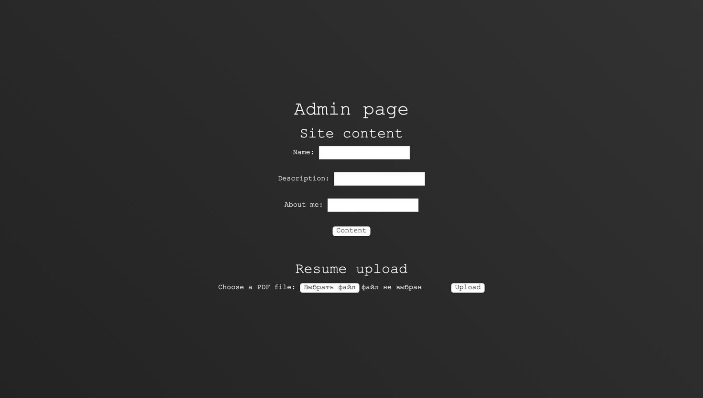

# A website with admin panel written in Rust that uses [GitHub GrapQl API](https://docs.github.com/en/graphql) to get info from my profile

## It's my own portfolio-site that shows my socials, skills and projects
## Watch it! -  [daniilubica.lol](https://daniilubica.lol)

